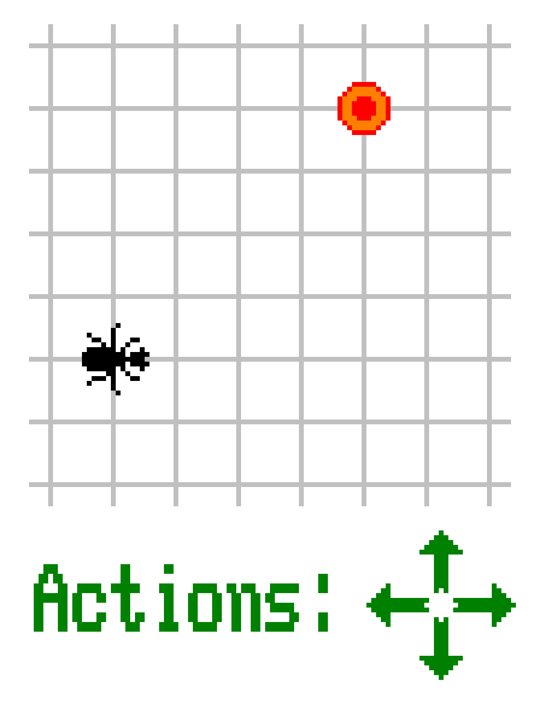
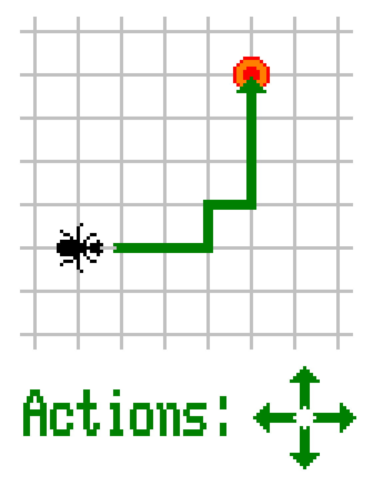
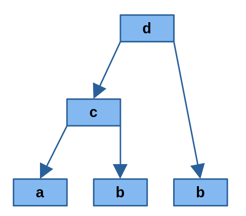
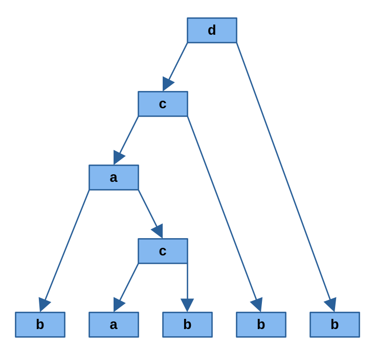
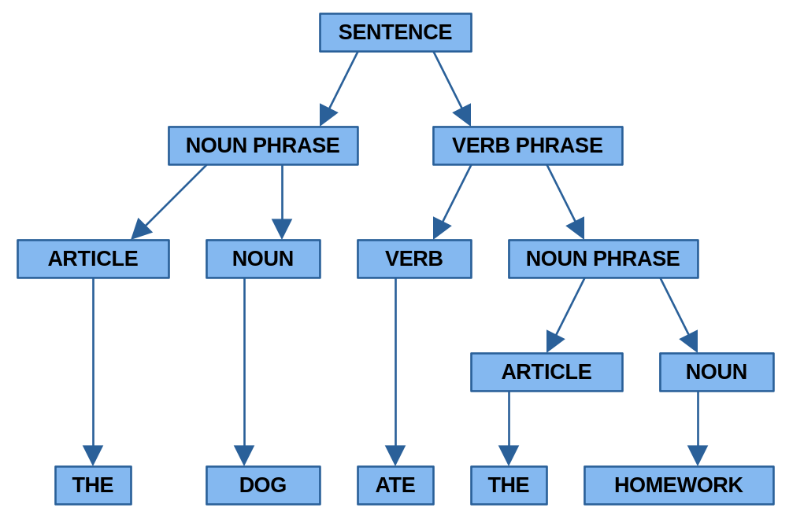
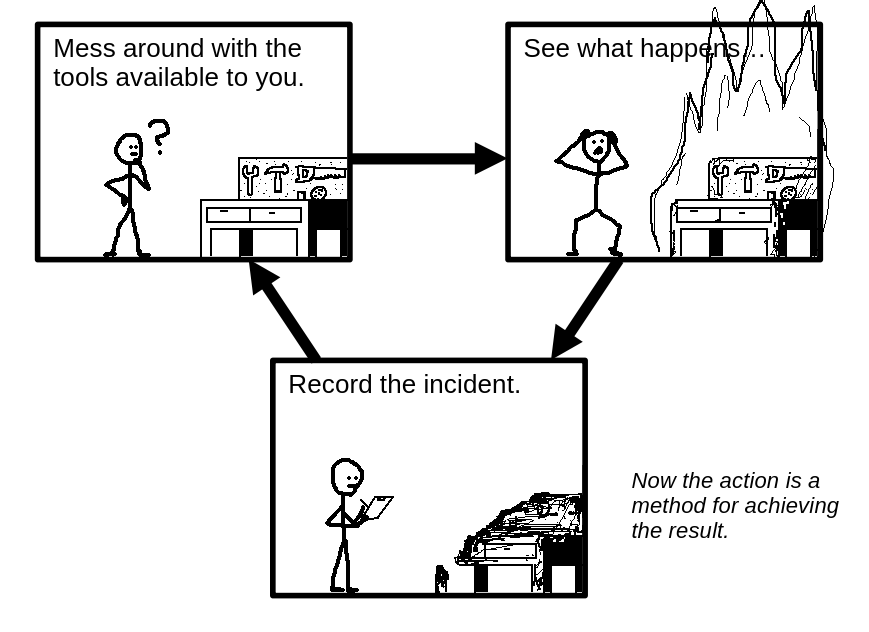

<style>
    p, ul, li {
        font-size: 26px;
        color: #000000;
    }
</style>

# On Grimoires

By Adrian Swande


---

# Research Question

> "What is the process by which methods (for solving problems) are found?"

- *Problems* are solved by finding their *solutions*.
- *Solutions* are found by employing *methods*.
- *Methods* exist within *predictable universes*.
- *general methods* exist within *generalizable universes*.

So we need, firstly, a predictable world in which our problems can be represented.

---

# Preliminaries: Groups

A *group* is a set of elements $G$ and a binary operator $*$ where the following conditions hold:

- *Closure*: $\forall [a,b] \in G^2 \ (a*b\in G)$
- *Associativity*: $\forall [a,b,c] \in G^3 \ ((a*b)*c=a*(b*c))$
- *Existence of Identity*: $\exists \varepsilon \in G\ (a\in G \implies a*\varepsilon = \varepsilon*a= a)$
- *Existence of Inverse*: $a\in G\implies \exists a^{-1} \in G\ (a^{-1}*a=\varepsilon)$

---

So, now we have a world in which to conduct our experiments.

We still haven't defined the term "problem", though...

---

# Problems

I define a *problem* (within a predictable world) as a combination of two things:

- *Set of Actions*: A set $M$ of *actions*, that is, functions from one world state to another. So if $f\in M$, then $f(s)=s'$, where $s\in S$, and $S$ is the set of all states of the world.
- *Goal*: A *goal* is a desirable world state $s\in S$.

A *solution* is then an ordered list of actions $[f_1, f_2,\cdots, f_n]$ such that $f_1\circ f_2\circ\cdots\circ f_n = s_0 \mapsto s_g$, where $s_0$ is our starting point, and $s_g$ is our goal state.

---



---



---

# Problems in Groups

What, then, is a *problem* in a group $G$, $*$?

- *States* are elements in $G$. So the *goal* is an elements $g\in G$.
- *Actions* are functions $x \mapsto a*x$, where $a\in G$.

Therefore a *solution* is a list 

$[x \mapsto a_1*x, x \mapsto a_2*x,\cdots, x \mapsto a_n*x]$

such that 

$(x \mapsto a_1*x)\circ( x \mapsto a_2*x)\circ\cdots\circ (x \mapsto a_n*x)=x\mapsto g$. 

So if we say that the set of actions $M$ is a subset of $G$ and that the initial state is $\varepsilon$, then we can reduce the notation to just 

$a_2*\cdots*a_n=g$.

---

# Free Exploration (1)

How do we, then, find methods?

We start by *freely exploring* the group using our provided repertoire of actions:

Let $M=\{a,b\}$. Let's try a combination!

$a*b=c$.

And now we know $[a,b]$ is a solution to $c$. We can now add $c$ to our repertoire, since we now know how to go to $c$ using $M$. So we can try another combination

$c*b=d$

and get the solution for $d$, since we can just expand $c$ like this: $c*a=a*b*b=d$. So the solution for $d$ becomes $[a,b,b]$.

---

# Free Exploration (2)

What if we find the same elements in different ways?

Say that

$b*a=d$

Then we have *two* methods for $d$, namely $\{[a,b,b],[b,a]\}$. If we find that $b*c=a$, then we have an infinite set of solutions for $d$, since $a$ can be expanded $a=(b*c)=b*(a*b)=b*(b*c)*b=b*b*(a*b)*b$ and so on.

---



---



---

# Method as Grammar



Now take a close look at the figure on the right. Does it look familiar?

The expansion from "sentence" to the resulting phrase is ruled by the following grammatical rules:

```
sentence    := [noun_phrase, verb_phrase]
noun_phrase := [article, noun]
verb_phrase := [verb, noun_phrase]
article     := ["the"]
noun        := ["dog"] or ["homework"]
verb        := ["ate"]
```

As you see, the way in which methods can be generated by experiences can be likened to a formal grammar.

---

But instead of defining a grammar, and then generating sentences which follow it, we have to actively define the grammar of our world's states by exploring the results of our actions.



---

# Grimoires (1)

So we want a way to express this self-defining grammatical structure of action and result.

I call this mathematical object a *Grimoire* -- a book of spells.

It simply a map which gives you the set observed of series of actions by which to get a result.

As an example, the grimoire of our previous exploration would be the map:

$\Phi = \left\{ \begin{array}{rcl} & a & \mapsto & \{[a],[b,c]\}\\ & b & \mapsto & \{[b]\}\\ & c & \mapsto & \{[a,b]\}\\ & d & \mapsto & \{[c,b]\}\end{array} \right\}$

---

# Grimoires (2)

### Formal definition a grimoire:

Let $G$ be a set closed under a binary associative operator $*$. Then a *grimoire* $\Phi$ is an injective map from a set of *spells* $\mathscr{S}_{\Phi}\subseteq G$ to a set of vectors of spells $\mathscr{S}_{\Phi}^{<\omega}$ of finite length such that $\{a_1,\cdots,a_n\}\in\Phi(b) \implies a_1*\cdots*a_n = b$.

### Formal definition an expansion function:

An *exploration function* is a map $\triangle:\Pi \times G^{<\omega} \to \Pi$ -- where $\Pi$ is the set of all grimoires of $G$ and $*$ -- be defined for some grimoire $\Phi$ by $\Phi'(b) = \Phi(b)$ for all $b\in \mathscr{S}_{\Phi} \setminus\{a_1*\cdots*a_n\}$ as well as $\Phi'(a_1*\cdots*a_n) = \Phi(a_1*\cdots*a_n)\cup\{[a_1,\cdots,a_n]\}$ if $a_1*\cdots*a_n\in \mathscr{S}_{\Phi}$, and $\Phi'(a_1*\cdots*a_n) = \{[a_1,\cdots,a_n]\}$ if not -- where $\Phi' = \triangle(\Phi, [a_1,\cdots,a_n])$ and $a_1,\cdots, a_n \in \mathscr{S}_\Phi$.

<!--
Let a map $\triangle:\Pi \times \mathcal{P}\left(G^{<\omega}\right) \to \Pi$ -- where $\Pi$ is the set of all grimoires of $G$ and $*$ -- be defined for some grimoire $\Phi$ by $\forall B\in \mathscr{S}_{\Phi} \setminus \set{R}\ \left(\Phi'(B) = \Phi(B)\right)$ and $\Phi'(R) = \Phi(R)\cup A$, where $R=\left\{\overset{ |\mathbf{a}| }{\underset{i=1}{*} }\mathbf{a}_i  \ |\   \mathbf{a}\in A\right\}$, if $R \in \mathscr{S}_{\Phi}$, and $\Phi'(R) = A$ otherwise -- where $\Phi' = \triangle(\Phi, A)$.
-->

---

How do we go further?

We can now predict specific outcomes from specific actions in our world -- how do we now produce *generalized* methods?

For that, we need a generalizable world!

We need substance to out group elements.

---

# Permutations (1)

A permutation on a set $A$ is a bijective map in $A\to A$. That is, a permutation maps each element in $A$ to a unique element in $A$, so all permutations are invertible.

A common notation for permutations is a collection of parenthesized list $(a_1,a_2,a_3,\cdots)(b_1,b_2,b_3,\cdots)\cdots$, where each element maps to its successor within its parenthesis, save for the last one, which maps to the first.

### Examples:

$(a,b,c)(d,e)$
$(a,c,d,h)(e,b,f)(g,j,i)$
$(\cdots, -2, -1,0,1,2,\cdots)$
$(a,b,c)$ -- *cycle*
$(a,b)$ -- *transposition*

---

# Permutations (2)

*$(356)$ short for $(3,5,6)$*
*$(356)(2467)$ short for $(356)\circ (2467)$*

### Composition Examples:

$(123)(23) = (12)$
$(123)(123) = (123)^{-1} = (132)$
$(15)(14)(13)(12) = (12345)$

Let $\pi = (\cdots, -2, -1,0,1,2,\cdots)$, then $\pi^3=\pi\pi\pi=(\cdots, -6, -3,0,3,6,\cdots)(\cdots, -5, -2,1,4,7,\cdots)(\cdots, -4, -1,2,5,8,\cdots)$
$=x\mapsto x+3$, for $x\in\mathbb{Z}$.

---

# Permutation Groups

A *permutation group* is a group of permutations under composition.

<!--
Permutations under function composition are:

- *Associative:* $\Big((142)(57)\Big)(24)=(14)(57)=(142)\Big((57)(24)\Big)$
- *Associative:* $\Big((142)(57)\Big)(24)=(14)(57)=(142)\Big((57)(24)\Big)$
-->

<br>

*Is this a "generalizable group"?*

---

# Grimoires of Permuation Groups (1)

Let $M=\{\alpha,\beta\}$, where $\alpha=(23)$ and $\beta=(123)$, and let $\Phi_0$ be an "empty" grimoire of $M$. Now let $\Phi_1=\triangle(\Phi_0, [\alpha, \beta])$. Now $\alpha\beta=(23)(123)=(13)$, so $\mathscr{S}_{\Phi_1}\ni (13)$.

Now, let $\Phi_2=\triangle(\Phi_1, [(13),\beta])$ and $\Phi_3=\triangle(\triangle(\Phi_2, [\beta,(13)]), [\beta,\alpha])$. Then 

<br>

$\Phi_3 = \left\{ \begin{array}{rcl} & \alpha & \mapsto & \{[(23)],[\beta,(13)]\}\\ & \beta & \mapsto & \{[(123)]\}\\ & (13) & \mapsto & \{[\alpha,\beta]\}\\ & (12) & \mapsto & \{[(13),\beta]\}\end{array} \right\}$

---

# Grimoires of Permuation Groups (2)

Now, since $\Phi_3((12))\ni [(13),\beta]$ and $\Phi_3((13))\ni [\alpha,\beta]$, we can derive a *solution* to $(12)$ using $M$:

$(12)=(13)\beta = \beta\alpha\beta = (123)(23)(123)$

---

This is all fine and dandy, but can we now, with our new fancy permutation group, *generalize* methods over elements in the group?


---

# Generalizations (1)

Let $\Phi$ be a grimoire of a permutation group defined by

$\Phi_3 = \left\{
    \begin{array}{rcl}
        & \alpha & \mapsto & \{[(23)],[\beta,(13)]\}\\
        & \beta & \mapsto & \{[(123)]\}\\
        & (13) & \mapsto & \{[\alpha,\beta]\}\\
        & (12) & \mapsto & \{[(13),\beta]\}
    \end{array} 
\right\}$
